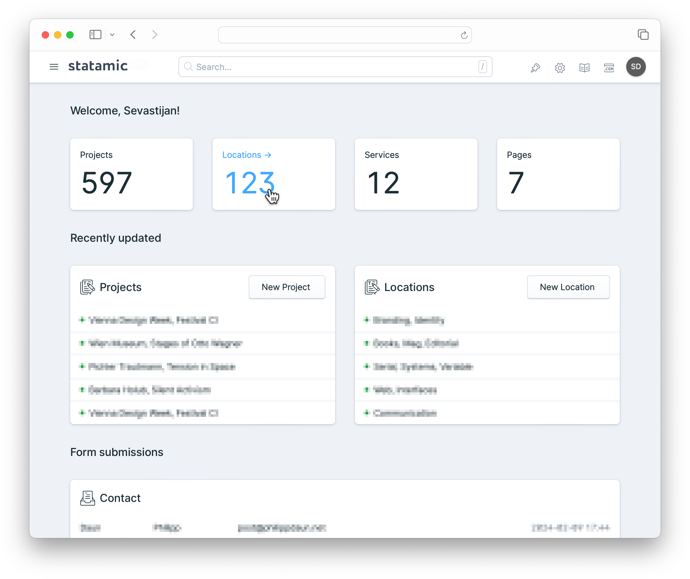

# Statamic Widget: Collection Count

Control panel widget for [Statamic](https://statamic.com/) that displays the
count of entries for a given collection or taxonomy.



## Installation

From your project root, run:

```sh
composer require daun/statamic-widget-collection-count
```

Alternatively, you can install the addon via the control panel.

## Usage

Add the widget to your control panel dashboard by adding it to the `widgets` array in the
`config/statamic/cp.php` config file. Pass in the name of the collection to show.

```php
return [
    'widgets' => [
        [
            'type' => 'collection_count',
            'collection' => 'projects'
        ]
    ]
];
```

## Options

### Ignore draft entries

By default, all entries are counted, including drafts. Set the `count_unpublished` variable to
`false` to only count published entries.

```php
return [
    'widgets' => [
        [
            'type' => 'collection_count',
            'collection' => 'projects',
            'count_unpublished' => false,
        ]
    ]
];
```

### Apply custom query scopes

Pass in the `query_scope` param to apply [custom scopes](https://statamic.dev/extending/query-scopes-and-filters) before counting.

```php
return [
    'widgets' => [
        [
            'type' => 'collection_count',
            'collection' => 'projects',
            'query_scope' => 'archived',
        ]
    ]
];
```

### Usage with taxonomies

The widget will happily count taxonomy terms as well. Just use the taxonomy name instead.

```php
return [
    'widgets' => [
        [
            'type' => 'collection_count',
            'collection' => 'tags',
        ]
    ]
];
```

## Requirements

Statamic 6 or higher. For Statamic 5 support, please use version 1.x of this addon.

## License

[MIT](https://opensource.org/licenses/MIT)
