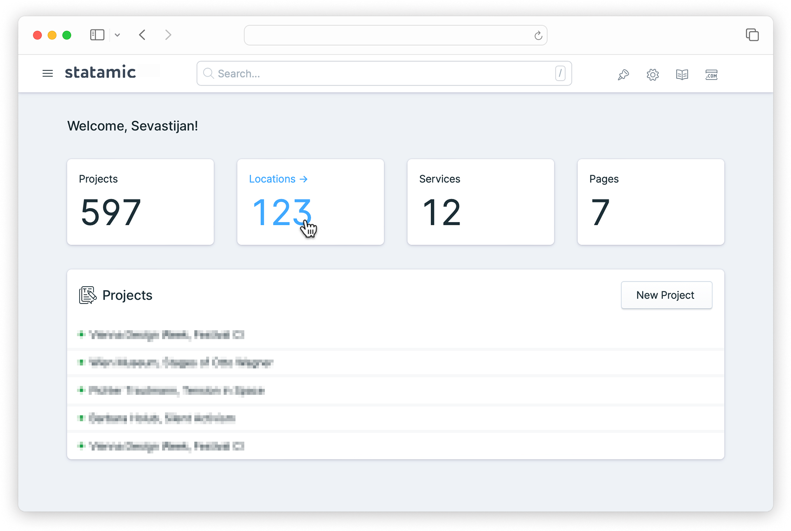

# Statamic Widget: Collection Count

Control panel widget for [Statamic](https://statamic.com/) that displays the
count of entries for a given collection.



## Installation

From your project root, run:

```sh
composer require daun/statamic-widget-collection-count
```

Alternatively, you can install the addon via the control panel.

## Usage

Add the widget to your control panel dashboard by adding it to the `widgets` array in the
`config/statamic/cp.php` config file. Pass in the name of the collection:

```php
return [
    'widgets' => [
        [
            'type' => 'collection_count',
            'collection' => 'projects'
        ]
    ]
];
```

## Requirements

Statamic 3+

## License

[MIT](https://opensource.org/licenses/MIT)
